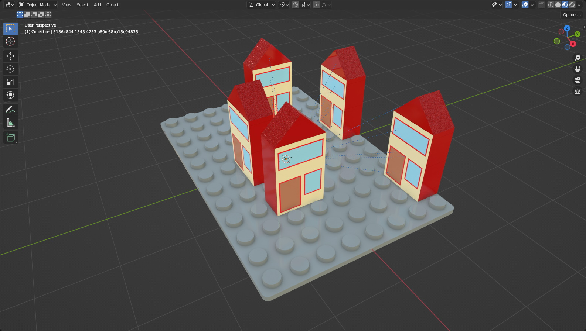
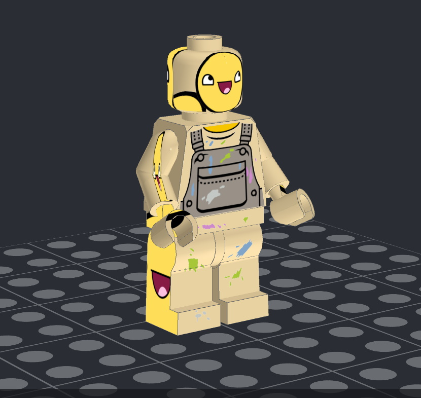
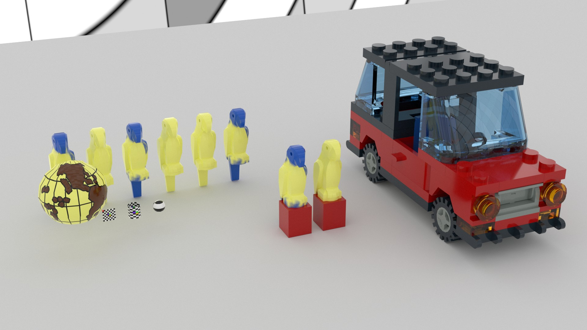
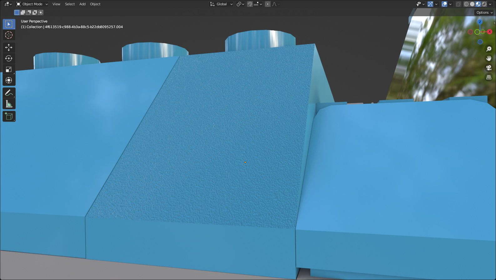
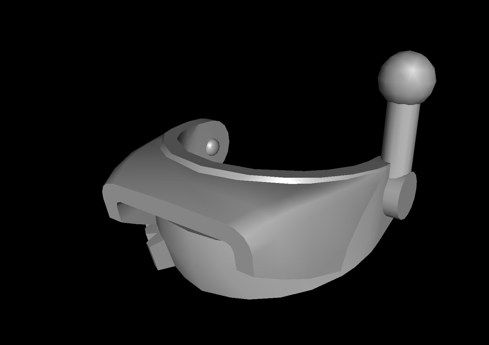

LDraw Handler for Blender 2.82+ and 3.0+, written by 
Matthew Morrison [cuddlyogre] - cuddlyogre@gmail.com - www.cuddlyogre.com

##### Pull requests and examples of this plugin in action are welcome.

I essentially learned Python by dissecting and studying https://github.com/TobyLobster/ImportLDraw, and it inspired me 
to make my own. This plugin wouldn't exist without that one.

I built this plugin with performance and compatibility in mind.

https://omr.ldraw.org/files/337 loads in about 13 seconds.  
https://omr.ldraw.org/files/338 has incorrectly written parts - 10252 - 10252_towel.dat is written as a model - and 
MLCad parts that import correctly.

It handles MLCad parts, LDCad projects, ldr, dat, and mpd files. It also processes most official META commands. For 
instance, STEP will set keyframes so you can watch the model be built. Theoretically, you could build an entire 
animation in an MPD file if you did it right. LeoCAD and LDCad groups are supported. LeoCAD cameras are supported as 
well. If you have LSynth parts installed, it will import those as well.

BFC meta commands are processed by default. Don't recalculate normals, as this will undo all BFC processing that might 
be done. CERTIFY and NOCERTIFY parts are both handled properly.

Materials were originally taken from from TobyLobster's plugin, but I've since made my changes and tweaks. 
One such addition is a glass material that was taken from [a BlenderArtists thread](https://blenderartists.org/t/realistic-glass-in-eevee/1149937/19).  

**A note on materials**  
Occasionally, a shader node will be removed from one version of Blender to the next, breaking materials that rely on them.
In those cases, I will do my best to keep a working collection of materials up to that point for the old version, but I won't focus on them for 
updates and tweaks unless something needs to be fixed.  
Blender's built-in glTF exporter doesn't export the materials correctly because of how complex the material node setup is. I am exploring other ways
to handle the materials. I'm leaning toward creating a simplified version of them for this task, but I haven't settled on anything just yet.

You are able to choose the logo you want to show on studs, or no logo or stud at all.

Importing TEXMAP is fully supported, including embedded image data using the DATA meta command. This includes planar, 
cylindrical, and spherical projections. Thanks to https://github.com/trevorsandy/lpub3d for the cylindrical and spherical math. 


The !DATA meta command for MPD files is fully supported. Read more [here](https://www.ldraw.org/article/47.html). A 
basic file using this spec can be found [here](https://www.ldraw.org/article/47.html#example).



**Stud.io**  
Stud.io parts can be used if you set the **Stud.io LDraw path** value correctly. On Windows, that should
be **C:\Program Files\Studio 2.0\ldraw**. This should auto-populate on Windows if Stud.io is installed.

Stud.io decals are mostly supported. There are some aspects of the spec I have to figure out still, but the current 
level of support should be sufficient for most things. In this example, the textures on the hands are missing. This is 
due to a more challenging part of the wholly undocumented pe_tex spec that Stud.io uses not yet being implemented.  

**Part with decal in PartDesigner**


**The same part imported into Blender**


**A note about Stud.io projects**  
Stud.io project files are in actuality just password-protected zip files, but due to regulations related to DRM, 
importing Stud.io projects will not ever be implemented here, even though it would be relatively trivial. 

Eevee and Cycles are both supported.

**Eevee**  


**Cycles**  


Sloped parts also have a slope texture applied to them. I have done my best to ensure that all parts in the list are
supposed to be textured and that the angles are correct. The slope angles can be adjusted in the object's material 
settings.



The ability to replace selected parts with different resolution parts is on my TODO list. For instance, 338 from
earlier has a lot of gaps in the tires and fender because the model is built with parts with different resolutions.

Names of parts and mesh data are uuid strings due to a 64 character string limit for names of items in Blender. This is
not ideal, but the LDraw filename is stored in the ldraw_filename custom property of the object/mesh.

### Notes

LDUs in BUs mean that LDraw scaling makes LDraw objects very large in the Blender viewport.

https://www.ldraw.org/article/218.html  
```
LDraw parts are measured in LDraw Units (LDU)  
1 brick width/depth = 20 LDU  
1 brick height = 24 LDU  
1 plate height = 8 LDU  
1 stud diameter = 12 LDU  
1 stud height = 4 LDU

Real World Approximations  
1 LDU = 1/64 in  
1 LDU = 0.4 mm
```
Items might be cut off because the far view plane is not far enough away. To solve that, go to the view tab in the
viewport and change **End** to 10000m.

# Importing

__File > Import > LDraw (.mpd/.ldr/.l3b/.dat)__

**config/import_options.json** Your import settings are saved here every time you import. If you run across any errors, 
delete config/import_options.json from the plugin folder. The defaults are saved and used immediately.

**LDraw path:** The path to your LDraw folder.  
The plugin will first look in your home folder and use that if an LDraw library is found. (~/ldraw)  
On Windows, the plugin searches the roots of A:-Z: for an LDraw folder. (C:\ldraw)  
If nothing is found, it will be blank.

**Stud.io LDraw path:** The path to the LDraw folder that comes with Stud.io. On Windows, this should auto-populate if Stud.io is installed.
It will be blank if nothing is found or on non-Windows systems.

**Import Options**

**Prefer Stud.io library:** Look in the Stud.io parts library first.  
**Prefer unofficial parts:** Look in the unofficial parts folder first.  
**Case-sensitive filesystem:** Defaults to false on Windows and Mac, true on linux. Set to true if you have set your LDraw path to be
case-sensitive on otherwise case-insensitive filesystems. Import speeds are slightly improved on case-insensitive filesystems.  
**Profile:** Runs cProfile during import. Saves **export_ldraw_import.prof** to the user's home folder. This file can be
viewed with **snakeviz**.
**Use alternate colors:** Uses LDCfgalt.ldr for more accurate colors.  
**Part resolution:** The quality of parts to use. Low resolution is quicker to import, but doesn't look as good. High
resolution looks better but take longer to import.  
**Color strategy:** How to color parts. **Vertex colors** are slightly faster but harder to work with. **Material** is 
recommended if you're going to be exporting parts.  
**Display logo:** Display the logo on the stud.  
**Chosen logo:** Which logo to display. logo and logo2 aren't used and are only included for completeness.  
**Freestyle edges:** Render LDraw edges using Freestyle.  


**Bevel Options**
**Bevel edges:** Bevel edges using a modifier. Some parts, namely logo studs, don't render correctly, so this is set to false by default.  
**Bevel weight:** **Bevel Weight** value applied to mesh edges 
**Bevel width:** Bevel modifier **Amount** value 
**Bevel Segments:** Bevel modifier **Segments** value 

**Scaling Options**

**Import scale:** What scale to import at. Full scale is 1.0 and is so huge that it is unwieldy in the viewport.  
**Parent to empty:** Parent the imported model to an empty to make it easier to manipulate.  
**Make gaps:** Make small gaps between bricks. A small gap is more realistic.  
**Gap scale:** Scale individual parts by this much to create the gap.  
**Gap target:** Whether to scale the object data or mesh data.  
**Gap strategy:** If object then the gap is applied to the object directly. If constraint, an empty named gap_scale can
be scaled to adjust to gaps between parts.

**Meta Commands** - Process LDraw META commands.

**BFC:** Process BFC commands.  
**GROUP:** Imports LeoCAD and LDCad groups.  
**PRINT/WRITE:** Prints PRINT/WRITE META commands to the system console.  
**STEP:** Adds a keyframe that shows the part at the moment in the timeline.  
**Frames per step:** How many frames to put between keyframes.  
**Set step end frame:** Set the final STEP keyframe.  
**CLEAR:** Hides all parts at before this point of the timeline.  
**SAVE:** Doesn't do anything.  
**Set timeline markers:** Add markers to the timeline where META commands were encountered.

**Cleanup Options**

**Remove doubles:** Merge vertices that are within a certain distance.  
**Merge distance:** How close the vertices have to be to merge them.  

**Smooth type:** Use an edge split modifier to smooth part faces, split edges during mesh processing, or use auto smooth.  
**Edge split** and **bmesh smooth** use **line type 2** to split sharp edges. If you want **line type 2** edges to be
marked sharp in edit mode, use **Edge split**.

**Shade smooth:**  Use flat or smooth shading for part faces.  
**Recalculate normals:** Recalculate normals during import to ensure all normals face outside. Completely overwrites any 
BFC processing. It is recommended to keep unchecked if processing BFC commands is checked  
**Triangulate faces:** Triangulate the mesh during import. Turns quads and ngons into tris.  

**Extras**

**Import edges:** Import LDraw edges as edges.  
**Treat shortcut parts as models:** Treat shortcut parts as if they were models by splitting them into their constituent
parts instead of merging them.  
**No studs:** Don't import studs. Not particularly useful but is neat to see.  

### LDraw Panel


The LDraw panel is where you can view LDraw properties of the active object, or the scene if no object is selected.
The LDraw properties of the scene are not used anywhere currently, but that may change.  

LDraw properties are set during import. This is also where the values that will be used during export are set. Not all
header fields are handled here, so you may still need to edit the exported file by hand to complete the header.

#### Header

On export, **Header** values populate that header value in the exported file. [Read more here.](https://www.ldraw.org/article/398.html)

**A note on the **Part type** fields**  
**Part type** is the **part_type** as determined by the importer.
**Actual part type** isn't used during export. It is the **part_type** as provided in the file at import.  

#### Part Attributes

During export, these values only apply to objects that do not have **Export polygons** checked    

**Color code**: The **color code** of the **line type 1**.  
**Filename**: The **part name** at the end of the **line type 1**. If a part was imported directly, this will be the full path to the part file.
Be sure to change this before you export unless you intend for the exported part to have a hardcoded absolute path.

#### Export Options

**Export precision**: This is used to round the decimal places that objects and polygon vertices are rounded to. 2 is more than sufficient for
most applications.  
**Export polygons**: Specifies whether the object will be exported as polygons or a **line type 1**.  

**Shade Smooth**: When exporting polygons, export all edges that are not marked sharp as **line type 5**.  
This is needed because LDView and several other LDraw viewers use **line type 5** to calculate smoothing. Smoothing works 
correctly in LDView for exported parts without any additional work, but these exported condtional lines don't render entirely 
correctly in LDView, so you may wish to use a dedicated utility like [Edger2](https://www.philohome.com/isecalc/edger2.htm) to 
generate conditional lines. If the part was imported with **Shade smooth** checked, this will be checked by default.  
**Note**: If this is unchecked, no **line type 5** is exported. Edges marked sharp are always exported as **line type 2**.   

  


***These are important for exporting properly sized parts. These will be checked by default on imported objects.***  
**Invert import scale matrix**: Negate **import_scale_matrix** on imported objects during export.   
**Invert gap scale matrix**: Negate **gap_scale_matrix** on imported objects during export.  

# Exporting

Exporting a part properly requires a bit of setup, but once that's taken care of it works well. Exported faces are
sorted by color code then by line type.

I have a few parts in the official parts library that were created in Blender and exported using this plugin.

You are able to export parts and models with the correct project setup. You can even build entire models in Blender, but
the workflow needs to be figured out for that to be any kind of fun.

If you're building a part from absolute scratch, model it like you normally would.

The exported file's header is determined by the **active object**.

The bare minimum an file needs to be successfully exported is a **Filename** to be set in the **active object**.
If a part file isn't generated on export, or a file you expected to be overwritten doesn't change, check that the 
**Filename** isn't blank.

Strictly speaking, you don't _need_ to import a part if you don't intend to export it as polygons. You could just 
use empties in their place with the proper transforms and **Filename** set, but that would be hard to visualize. 

Objects **must** have a rotation of **-90 degrees X** in order to be exported with the correct rotation. 

Parent objects you plan to export to an empty with a rotation of **-90 degrees X** to make things easier to 
work with. This will also allow you to set the header values for the exported file independently of its parts, such as
when you are exporting a model.

Objects are exported with their scale applied, which may result in a part that isn't the size you expect. If you are building
the object by hand, clear the scale. 

Don't alter the scale of imported objects. The import matrices of imported objects will be negated on export so long as the respective
checkbox is checked. For that reason, 

#### If you want to export just the edges of a Blender mesh as line type 2

face select mode > select all > delete **Just Faces** > edge select mode > 
select all > right click > **Mark Sharp** > make sure the values are filled in correctly in the 
LDraw panel > check **Export polygons** > and export as normal.

### Export Panel

__File > Export > LDraw (.mpd/.ldr/.l3b/.dat)__

**LDraw filepath:**  Used for validating color codes.

**Export Options**

**Selection only:** Only export selected objects.  
**Use alternate colors:** Same as above. Used for validating color codes.  

**Cleanup Options**

**Remove doubles:** Same as above. Helps minimize file size.  
**Merge distance:** Same as above.  
**Recalculate normals:** Recalculate mesh normals. Does not affect **line type 1** exports.  
**Triangulate mesh:** Triangulate the mesh. Turns quads and ngons into tris.  
**Ngon handling:** How to handle ngons. Skip ignores any ngons. Triangulate splits them into
triangles.

### Development

If you want to make changes to the plugin, this will help  
```pip install fake-bpy-module-2.82```  
```pip install fake-bpy-module-2.93```  
```pip install fake-bpy-module-3.0```  
```pip install fake-bpy-module-latest```  
More information here: https://github.com/nutti/fake-bpy-module
